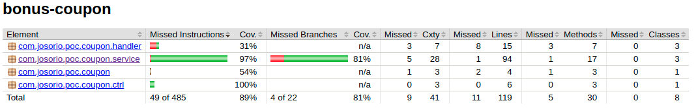

# coupon-challenge

Esta solución expone una funcionalidad en la cual recibe una lista de items que puedes estar relacionados a una lista de favoritos, y un monto asociado al valor que tienes disponible para realizar una compra para retornar una lista con la cantidad máxima de items que puedes adquirir con el monto indicado. 

**Content**
- [coupon-challenge](#coupon-challenge)
  - [Control de Cambios](#control-de-cambios)
  - [Tecnologías utilizadas](#tecnologías-utilizadas)
  - [Como correr el proyecto.](#como-correr-el-proyecto)
    - [Configurar Variable de entorno](#configurar-variable-de-entorno)
    - [Compilar el proyecto y generar el ejecutable](#compilar-el-proyecto-y-generar-el-ejecutable)
    - [Validación de código estático](#validación-de-código-estático)
    - [Ejecución del proyecto](#ejecución-del-proyecto)
    - [Probar el proyecto](#probar-el-proyecto)
  - [Aprovisionar infraestructura Cloud](#aprovisionar-infraestructura-cloud)
    - [Orden de ejecución de módulos iac](#orden-de-ejecución-de-módulos-iac)


## Control de Cambios

| Versión | Fecha | Responsable | Comentarios | 
|--|--|--|--|
| v.1.0.0 | Agosto, 2021 | [Jeisson Osorio]() |    Versión inicial |

## Tecnologías utilizadas

Esta solución esta desarrollada con Springboot y para utilizarla debes contar con:

- Java 11
- Maven
- Docker (opcional)

## Como correr el proyecto.

* Garantizar que en el equipo en el cual se quiere validar la solucion cuente con maven y java 11
* Realizar un checkout del repositorio. 
* Ubicarse en la ruta `coupon-challenge/bonus-coupon`

### Configurar Variable de entorno 

* Crear variable de entorno API_ENDPOINT.
   1. El proyecto realiza un integracion con una api externa la cual brida la informacion del costo de los productos que llegan en la lista. por tal motivo es necesario que el endpoint de esta api destino sea configurado en la variable de entorno $API_ENDPOINT.
   2. En caso de que no se desee crear la variable de entorno, se debe actualizar el archivo application.yml ubicado en la ruta  `bonus-coupon/src/main/resources` colocando directamente el valor deseado como se muestra en el siguiente ejemplo:

```yml
## Usando variable de entorno
coupon:
  item-api-endpoint: ${API_ENDPOINT}
  time-out: 5000

## Sin variable de entorno
coupon:
  item-api-endpoint: https://host:port/api/
  time-out: 5000
```

* La API Configurada debe cumplir con las siguientes Características:


  1. Exponer método GET con la siguiente firma.

> https://host:port/api/$ITEM_ID
> 
> curl -X GET https://host:port/api/$ITEM_ID


  2.  El mensaje de respuesta debe ser de tipo JSON y debe contener el valor del precio en la etiqueta price

```json
{
  "id": "MCO643695188",
  "site_id": "MCO",
  "price": 703200
  ...
}
```

### Compilar el proyecto y generar el ejecutable

* Ejecutar el siguiente comando maven en la ruta `coupon-challenge/bonus-coupon`
  
```bash
    mvn clean package install
```

### Validación de código estático 

* Validación de código (Opcional): si cuenta con una instalación de Sonarqube o desea usar sonar cloud incluir en el comando anterior la publicación de las pruebas en sonar para que se realice la respectiva validación de código.

```bash
    mvn clean package install && mvn sonar:sonar
```

> El código actual del proyecto arroja el siguiente resultado con las quality gates default de [Sonarqube](https://www.sonarqube.org/). 


* Validación del reporte de Jacoco (Opcional): una vez se han ejecutado los comandos para la generación de artefactos del proyecto se creara un reporte de Jacoco el cual se podrá ubicar en la siguiente ruta: `coupon-challenge/bonus-coupon/target/site/jacoco/index.html`

> En este reporte se podrá evidenciar el coverage de las pruebas unitarias ejecutadas.




### Ejecución del proyecto  

Este proyecto esta construido con springboot por lo cual puede ejecutar directamente la aplicación como una app springboot sin embargo los pasos descritos a continuación son para contenerizar la aplicación utilizando Docker. 

1. Garantizar que ya se hallan generado los binarios del proyecto en la capeta target (`coupon-challenge/bonus-coupon/target/`)
2. Tener Docker instalado.
3. Ubicarse en la ruta `coupon-challenge/bonus-coupon/`
4. Crear la imagen con el siguiente comando:
```bash
    docker build -t coupon .
```
5. Subir container de docker con el siguiente comando:
```bash
  ## Correr container como daemon
    docker run -d -p 8080:8080 --name coupon -e API_ENDPOINT=$API_ENDPOINT coupon:latest
  ## Correr con consola interactiva 
    docker run -it -p 8080:8080 --name coupon -e API_ENDPOINT=$API_ENDPOINT coupon:latest
```
> **Nota:** Tener en cuenta que en el comando anterior se asume que existe la variable de entorno ***$API_ENDPOINT*** y que el servicio esta utilizando la variable de entorno. En caso de que en el archivo ***application.yml*** se halla realizado la configuración del endpoint directo a la api destino, no es necesario enviar la variable de entorno en el comando de docker. 


### Probar el proyecto

La aplicación expone una api por el puerto 8080 en la siguiente URL:

> http://localhost:8080/v1/coupon/

**Nota:** esa url aplica si desplegó en local con docker o como app springboot.

Para probar la funcionalidad se debe enviar una petición POST con la siguiente estructura:


```json
{
    "item_ids" : ["MCO643695188","MCO475364594", "MCO539018277", "MCO641531650", "MCO475364594", "MCO643469624"],
    "amount" : 1000000    
}
```

Al enviar la petición la API dará una repuesta de la siguiente manera:

```json
{
    "item_ids": [
        "MCO475364594",
        "MCO539018277",
        "MCO643469624"
    ],
    "total": 479880.0
}
```
En la anterior respuesta se obtener una lista con el máximo de items que se pueden comprar y el costo total.

> **Nota:** Puede utilizar el proyecto postman `coupon-challenge.postman_collection.json` el cual se encuentra en la raíz del repositorio para ejecutar las pruebas.


## Aprovisionar infraestructura Cloud

Este ejercicio cuenta con una sección de aprovisionamiento de infraestructura cloud para presentar una solución elástica y escalable que soporte una alta demanda. la solución de IaC esta desarrollada con Terraform y todos los artefactos requeridos se encuentran ubicados en la ruta: `coupon-challenge/iac` para mas información acerca de la solución puede validar el readme de iac [aqui](iac/README.md "IaC").


### Orden de ejecución de módulos iac

Para poder ejecutar lo modulo tiene que seguir previamente todas las directrices indicadas en el modulo de IAC adicionalmente requiere tener instalado terraform en la maquina desde la cual desea realizar el aprovisionamiento. 

1. En el modulo de red (`coupon-challenge/iac/coupon-env/networking`) ejecutar los siguientes comandos: 
```bash
terraform init
terraform workspace new dev
terraform plan
terraform apply 
```
2. En el modulo de recursos (`coupon-challenge/iac/coupon-env/resources`) ejecutar los siguientes comandos: 
```bash
terraform init
terraform workspace new dev
terraform plan
terraform apply 
```

> Nota: después de ejecutar el modulo de recursos se deben contemplar los siguientes puntos:

- Realizar un push de la imagen docker generada del servicio al repositorio ECR creado en la cuenta de AWS antes de continuar con la ejecución del modulo de servicios.
- Crear usuario en cognito para poder acceder al servicio que se publicara en apigateway

3. En el modulo de servicios (`coupon-challenge/iac/coupon-env/services`) ejecutar los siguientes comandos: 
```bash
terraform init
terraform workspace new dev
terraform plan
terraform apply 
```
> Esta ultima ejecución creara la API en la cual quedara expuesto el servicio y subirá el servicio de coupon en el cluster de ECS de acuerdo con la arquitectura reverenciada. 
