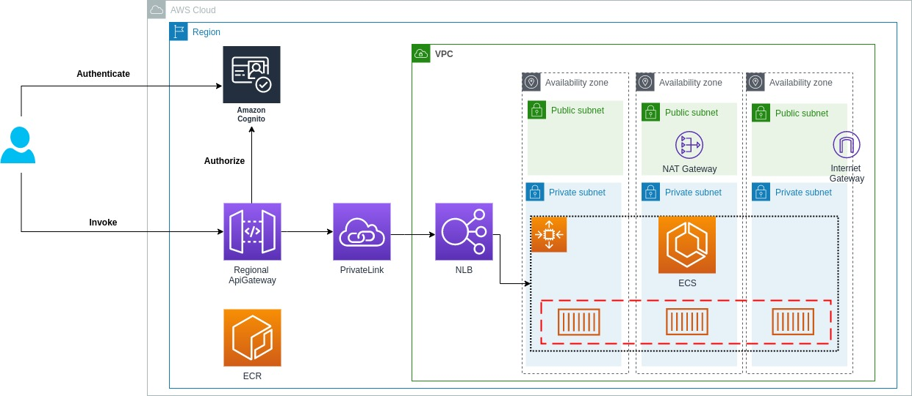
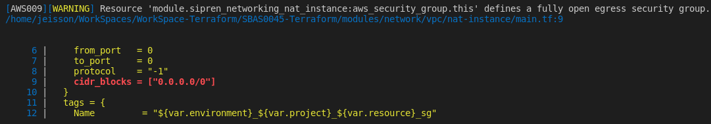

# Coupon-Challenge 

En este proyecto se encuentran las definiciones de IaC and CaC en Terraform del proyecto Coupon-Challenge.

### Control de Cambios

| Versión | Fecha | Responsable | Comentarios | 
|--|--|--|--|
| v.1.0.0 | ago 21, 2021 | [Jeisson Osorio]() |    Versión inicial |


## Tabla de Contenido
- [Coupon-Challenge](#coupon-challenge)
    - [Control de Cambios](#control-de-cambios)
  - [Tabla de Contenido](#tabla-de-contenido)
  - [Arquitectura de la solución](#arquitectura-de-la-solución)
  - [Flujo de comandos a ejecutar:](#flujo-de-comandos-a-ejecutar)
  - [Validar Seguridad de Código](#validar-seguridad-de-código)
  - [Estructura de los proyectos](#estructura-de-los-proyectos)
  - [Ejecución de módulos del proyecto](#ejecución-de-módulos-del-proyecto)
    - [Pre-requisitos](#pre-requisitos)
    - [Orden de ejecución de los módulos](#orden-de-ejecución-de-los-módulos)


## Arquitectura de la solución 




## Flujo de comandos a ejecutar:

* Iniciar plantilla o ejecución
>terraform init

* Iniciar plan de ejecución
> terraform plan

* Aplicar el plan
> terraform apply

* Eliminar los componentes creados con la plantilla
> terraform destroy

* Validación y creación de workspace
> terraform workspace 
> 
>  **Crear workspace de desarrollo - dev**:  
> 
> terraform workspace new dev

* Validar configuración de código 
> terraform validate

## Validar Seguridad de Código


Para poder realizar la operación de validación de código se puede hacer uso de la herramienta tfsec la cual debe ser previamente instalada.

Para mas información de esta herramienta se puede validar **[tfsec](https://github.com/tfsec/tfsec )**  

* Escaneo de código con **tfsec** 
> **Ejemplo 1**: Escaneo recursivo: 
> 
> tfsec .
> 
> **Ejemplo 2**
> 
> tfsec ./source_project

* Excepciones de validación con **tfsec**

Para aquellos casos en los cuales en la validación de código estático se obtienen alertas sobre configuraciones que se requieren o se tienen contempladas en la solución, se debe proceder a configurar la excepción en el código fuente y realizar la documentación correspondiente a la excepción.

**Ejemplo:**

Error Generado </br>



Excepción configurada

```hcl
  egress {
    from_port   = 0
    to_port     = 0
    protocol    = "-1"
    #tfsec:ignore:AWS009
    cidr_blocks = ["0.0.0.0/0"]
  }
```

## Estructura de los proyectos

En la estructura  se define el uso de plantillas re-utilizables las cuales se encuentran en la raíz del repositorio en las carpetas de la carpeta de modulos **application, network**. 

En la carpeta de **parameters** se encuentra la configuración para la aplicación de las plantillas haciendo uso de workspaces de terraform **terraform workspace**


|Proyecto        |Descripción                          |
|----------------|-------------------------------|
|[parameters](parameters/README.md "Documentación modulo de parámetros")|`Se definen las variables por ambiente para uso del workspace de terraform` |
|modules|`Paquete de módulos re-utilizables para la definición de la infraestructura y servicios utilizados por la solución`|
|***coupon-env*** |`Paquete de módulos utilizado para orquestar la ejecución de templates y definición de recursos`            |
|***coupon-env/networking*** |`Modulo utilizado para la creación de recursos de red de la solución`          |
|***coupon-env/resources*** |`Modulo utilizado para la creación de recursos de computo y transversales de la solución`          |
|***coupon-env/services*** |`Modulo utilizado para la creación de recursos asociados a servicios de la solución`          |


## Ejecución de módulos del proyecto 

### Pre-requisitos

Antes de iniciar con la ejecución de los proyectos terraform de se debe garantizar la ejecución/preparación de los siguientes puntos:

1. Definir los datos de la cuenta en la cual se ejecutara el proyecto `AWS_ACCESS_KEY_ID,  AWS_SECRET_ACCESS_KEY, AWS_DEFAULT_REGION`

**Uso de Variables de entorno**: Se deben configurar las siguientes variables de entorno con los datos de la cuenta que se ejecutara las plantillas de Terraform. 
```hcl
  export AWS_ACCESS_KEY_ID="AKIARGKJ**********"
  export AWS_SECRET_ACCESS_KEY="TJDuL0gcUE3RD0******************"
  export AWS_DEFAULT_REGION="us-east-2"
```

2. Crear Bucket S3 `dev-couponpoc-terraform-state-s3` en la region `us-east-1` en la consola administrativa de AWS. Este bucket es donde se alojaran los remote states de los proyectos ejecutados.

>**Nota:** Tener en cuenta que el nombre del bucket debe coincidir con el nombre de la key configurada en el backend de cada uno de los proyectos a ejecutar.


1. Validar los datos del modulo de parámetros que con los cuales se requiera ejecutar el proyecto [Readme Modulo Parámetros](parameters/README.md "Documentación modulo de parámetros")

2. Crear el workspace asociado a la ejecución para poder realizar la carga de los parámetros definidos en el modulo de parámetros. [Workspaces Modulo Parámetros](parameters/README.md#uso-de-workspace-terraform "Manejo de Workspace")

>  **Ejemplo:**: Crear workspace de desarrollo  
>
> terraform workspace new dev


### Orden de ejecución de los módulos


|Step |Modulo |Requerido |Descripción  |
|-----|-------|----------|-------------|
|1| coupon-env/networking | Si|Creación de todos los ***recursos de red*** asociados a la arquitectura de la solución. |
|2| coupon-env/resources | Si| Creación de los ***recursos de aplicación*** asociados a la infraestructura de la solución (Balanceadores, Cluster, Repositorios). |
|3| coupon-env/services| No| Creación de los recursos de arquitectura asociados a servicios de la solución (api gateway, ECS Service Definitions... ) |
